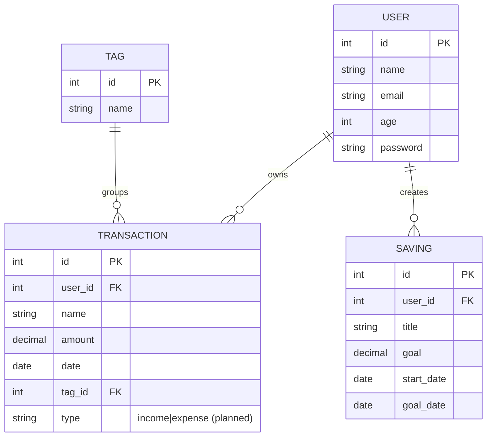

# Personal Finance Tracker

## Overview

Personal Finance Tracker is a full-stack web application that helps users understand and manage their money in one place. A user can securely log in, record their financial transactions, define savings goals, and view a dashboard that turns their activity into a clear cash-flow summary.

The application focuses on answering practical questions such as:

- How much money has come in and gone out?
- Where is most money being spent?
- What is the current cash-flow position for a selected period?
- How close is the user to each savings goal?

The project uses a React and Vite frontend in `client/` and a Flask API in `server/`. The API uses SQLite through SQLAlchemy for local data storage.

## User flow

```text
Login
  ↓
Dashboard
  ↓
Transaction summary and analysis
  ├── Cash inflow (income)
  ├── Cash outflow (expenses)
  ├── Net cash flow / balance
  ├── Recent transactions
  ├── Spending by tag
  └── Savings-goal progress
```

1. **Login**: A user signs in with their account credentials. The backend authenticates the user and issues a JWT access token.
2. **Dashboard**: After login, the user is taken to their financial dashboard.
3. **Summary and analysis**: The dashboard retrieves the user’s transactions and savings goals, then presents totals, recent activity, tag breakdowns, and visual charts.
4. **Manage transactions**: The user can add, review, update, or remove transactions and assign each transaction to a tag.
5. **Track savings**: The user can create savings goals with a target amount and target date, then monitor their progress over time.

## Existing data models

The backend models in `server/app/models/` provide the foundation for the application.

| Model | Purpose | Current fields |
| --- | --- | --- |
| `User` | Stores account information for each person using the application. | `id`, `name`, `email`, `age`, `password` |
| `Transaction` | Stores an individual financial record owned by a user. | `id`, `name`, `user_id`, `amount`, `date` |
| `Tag` | Groups transactions for analysis, such as Salary, Groceries, Rent, Medical, or Transfer. | `id`, `name` |
| `Saving` | Stores a savings target belonging to a user. | `id`, `title`, `goal`, `start_date`, `goal_date`, `user_id` |

### Current database relationships

- A `User` can own many `Transaction` records.
- A `User` can have many `Saving` goals.
- A `Transaction` can be associated with many `Tag` values through a join table.
- A `Tag` can be attached to many `Transaction` records.

### Entity relationship diagram



### Recent backend changes

The backend has evolved beyond the original single-tag assumption. The latest changes include:

- Added proper SQLAlchemy relationships between `User`, `Saving`, `Transaction`, and `Tag`.
- Switched transaction tags to a many-to-many association so a transaction can carry multiple tags.
- Added Flask-Migrate support and applied database revisions for the updated schema.
- Added a seed script at `server/seed.py` that populates the database with sample users, savings goals, tags, and transactions.
- Updated the Flask API structure so the routes and controllers align with the current model design.

These changes make the app better suited for a financial tracker because tags can now represent either payment modes or transaction categories such as business, groceries, home appliances, dining, rent, and transfer.

## Project structure

```text
Full-Stack_Project/
├── client/                         # React and Vite frontend
│   └── src/
│       ├── pages/Authentication/   # Login page
│       ├── pages/Dashboard/        # Overview, summary, transactions, savings, expenses, settings
│       ├── components/             # Shared UI components such as the sidebar and profile
│       ├── context/                # User, data, and theme state
│       └── api/                    # Client-side API requests
├── server/                         # Flask backend
│   ├── app/
│   │   ├── models/                 # User, transaction, tag, and savings models
│   │   ├── routes/                 # API endpoint modules
│   │   ├── controllers/            # Request and business logic
│   │   ├── schemas/                # Validation and serialization schemas
│   │   └── extensions.py           # Database, JWT, and Marshmallow setup
│   ├── app.py                      # Flask application configuration
│   └── requirements.txt            # Python dependencies
└── README.md
```

## Frontend dependencies

Frontend dependencies are listed in `client/package.json`.

| Dependency | Use in this application |
| --- | --- |
| `react`, `react-dom` | Build the user interface. |
| `vite` | Frontend development server and production build tool. |
| `react-router-dom` | Navigate between login and dashboard pages. |
| `@tanstack/react-query` | Fetch, cache, and refresh API data. |
| `react-hook-form`, `zod` | Build and validate login, transaction, and savings forms. |
| `recharts` | Display cash-flow, category, and trend charts. |
| `date-fns` | Format and filter transaction dates. |
| `react-hot-toast` | Display success and error messages. |
| `react-icons` | Provide interface icons. |
| `framer-motion` | Add UI transitions and animations. |
| `tailwindcss` | Style the interface. |
| `@react-oauth/google` | Optional Google sign-in integration. |

## Backend dependencies

Backend dependencies are listed in `server/requirements.txt`.

| Dependency | Use in this application |
| --- | --- |
| `Flask` | Provides the REST API. |
| `Flask-SQLAlchemy`, `SQLAlchemy` | Define and query the database models. |
| `Flask-Migrate`, `alembic` | Create and apply database migrations. |
| `Flask-JWT-Extended` | Authenticate users and protect user-specific routes. |
| `flask-cors` | Allows the frontend to call the API during development. |
| `Flask-Marshmallow`, `marshmallow`, `marshmallow-sqlalchemy` | Validate requests and serialize API responses. |
| `pytest`, `pytest-flask` | Test the Flask application. |
| `gunicorn` | Run the API in production. |

## Requirements

Install the following before running the project:

- [Node.js](https://nodejs.org/) 20 or later, including npm
- Python 3.10 or later
- Git

SQLite is the current local database and does not need a separate database server. The Flask configuration currently creates/uses `server/app.db` through `sqlite:///app.db`.

## Installation

### 1. Install frontend dependencies

```bash
cd client
npm install
```

Start the frontend development server:

```bash
npm run dev
```

### 2. Install backend dependencies

From the project root:

```bash
cd server
python3 -m venv .venv
source .venv/bin/activate
pip install -r requirements.txt
```

Create and apply the database migrations:

```bash
flask db upgrade head
```

Seed the database with sample data:

```bash
python seed.py
```

Start the Flask server:

```bash
python app.py
```

## Configuration

The current Flask configuration in `server/app.py` uses SQLite and JWT authentication. Before production deployment, move sensitive settings out of source code and provide them as environment variables:

```text
DATABASE_URL=<production database connection string>
JWT_SECRET_KEY=<long random secret>
CLIENT_URL=<frontend URL>
GOOGLE_CLIENT_ID=<optional, for Google sign-in>
```

## Planned API capabilities

The backend route and controller folders are organised for these endpoints:

- Account registration and login
- User profile management
- Transaction create, read, update, and delete operations
- Transaction tags
- Savings-goal create, read, update, and delete operations
- Dashboard totals and chart-ready analysis data

Each protected endpoint should use the JWT identity to ensure that a user can access only their own transactions and savings goals.