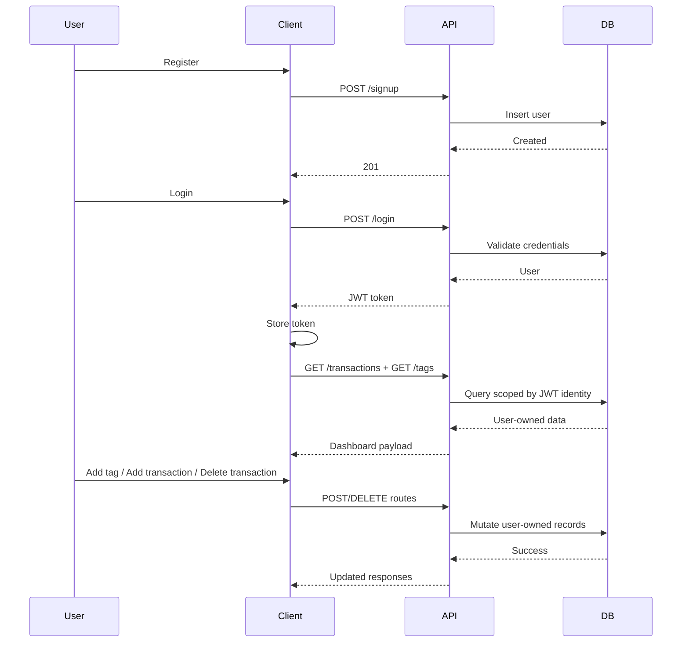
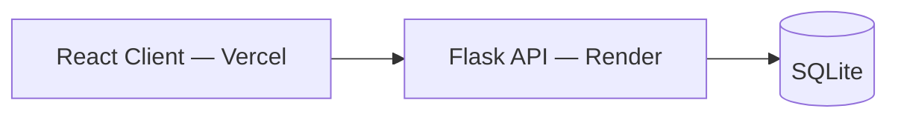
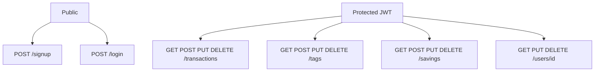
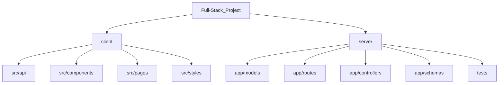
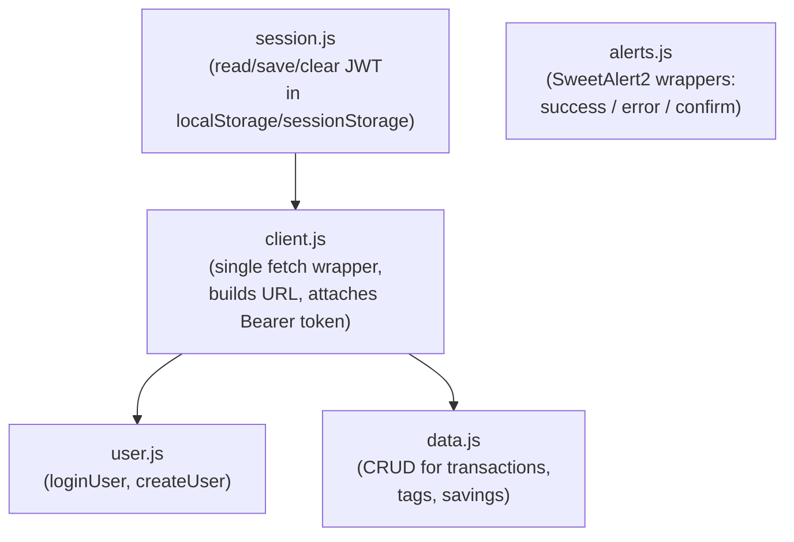
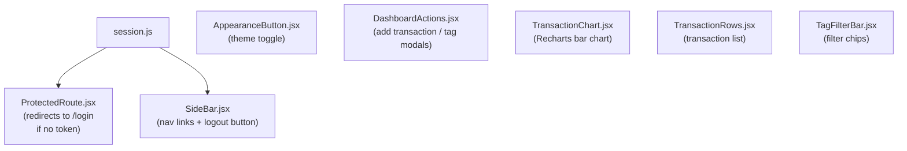
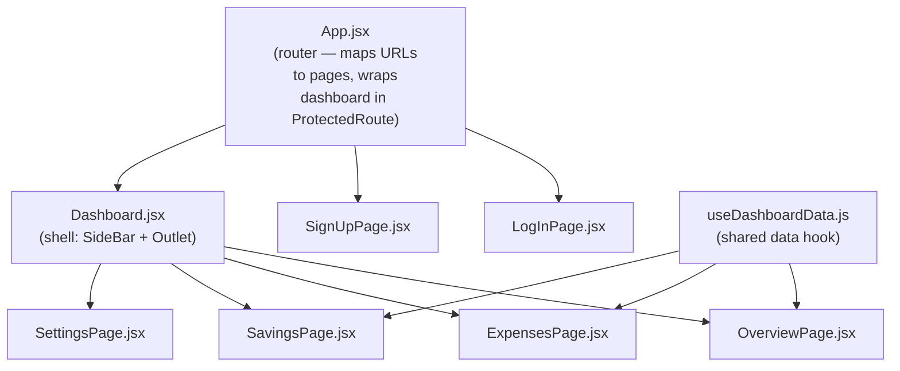
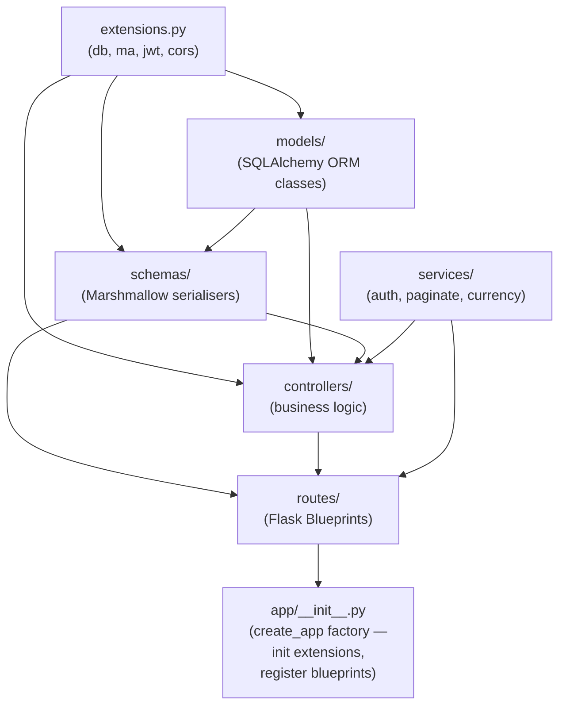

# Executive Finance Platform

## Functionality

### Authentication
- Public signup — name, email, age, password; password stored as bcrypt hash
- Login returns a signed JWT; token persisted in `localStorage` (remember me) or `sessionStorage` (session only)
- Every protected route and API call requires a valid `Bearer` token
- Logout clears the token and redirects to the login page

### Dashboard — Overview
- **Metric cards** (live, update on every data change)
  - **Net Flow** — monthly income minus total expenses; gold glow indicator
  - **Total Income** — the monthly income figure set by the user (stored in `localStorage`)
  - **Total Expenses** — sum of absolute amounts across all loaded transactions
  - **Total Transactions** — count of loaded records
- **Live UTC clock** — ticks every second in the page header
- **Tag filter bar** — filter all data on screen by a single tag
- **Line chart** — plots all loaded transactions over time:
  - **Income** — dashed flat reference line at the user's monthly income ceiling (only shown when income is set)
  - **Expenses** — per-day spending total (fluctuates); rendered in red
  - **Savings** — `income − cumulative expenses`; rendered in orange (only shown when income is set)
  - Y-axis anchored to the income value when set
- **Transaction table** — paginated (10 rows per page with a "Load more" button), columns: date, description, amount (shown as negative), tags, actions
  - Add a tag to any row via an inline select
  - Remove any individual tag from a row with an × button
  - Delete a transaction (confirm dialog)

### Data Actions panel
- **Monthly Income form** — user sets a single monthly income value; persisted to `localStorage` and immediately reflected in metrics and chart
- **Add Expense form** — description, amount (always stored as a negative number), optional date, optional tag selection (multi-select chips); posts to `/transactions`
- **Add Tag form** — creates a named label; displays all existing tags as chips with individual × delete buttons; deletion confirmed before hitting the API

### Sidebar
- Collapsible — icon-only mode when collapsed
- Navigation links: Dashboard (Overview), Savings, Settings
- **Dark / Light mode toggle** — uses the `AppearanceButton` component; writes `theme-dark` or `theme-light` to `body` and persists choice to `localStorage`; all backgrounds, borders, and text colours switch via CSS custom properties
- Logout button — clears token, redirects to `/authentication/login`

### Auth Pages
- Login and Signup pages share a split-panel layout (form + animated visual side)
- `AppearanceButton` is present on both pages (top-right floating pill)
- Form inputs, placeholders, and focus rings adapt to the active theme via CSS variables

---

### Backend API

All endpoints except `POST /signup` and `POST /login` require `Authorization: Bearer <token>`.

| Resource | Methods | Notes |
|----------|---------|-------|
| `/signup` | `POST` | Creates a user; validates email format; hashes password |
| `/login` | `POST` | Verifies credentials; returns JWT with `id` and `email` claims |
| `/transactions` | `GET POST` | Scoped to the authenticated user; supports `page` / `per_page` query params |
| `/transactions/<id>` | `GET PUT DELETE` | Owner-only; `PUT` accepts optional `tag_ids` array to update associations |
| `/tags` | `GET POST` | Global tag list; readable by any authenticated user |
| `/tags/<id>` | `GET PUT DELETE` | Full CRUD for individual tags |
| `/savings` | `GET POST` | Saving goals scoped to the authenticated user; paginated |
| `/savings/<id>` | `GET PUT DELETE` | Owner-only saving goal management |
| `/users` | `GET POST` | Authenticated user lookup / creation |
| `/users/<id>` | `GET PUT DELETE` | Owner-only profile read and update |

**Stack:** Flask · Flask-JWT-Extended · Flask-SQLAlchemy · Flask-Marshmallow · Flask-CORS · Flask-Migrate · SQLite (dev) / configurable via `DATABASE_URL`

**Security:** passwords hashed with Werkzeug (`generate_password_hash` / `check_password_hash`); JWT secret read from `JWT_SECRET_KEY` env variable; CORS restricted to configured origins.

**Transactions ↔ Tags** — many-to-many via a `transactions_tags` association table; tag array updated atomically on every `PUT /transactions/<id>`.

**Pagination** — a shared `paginate()` utility wraps every list query and returns `items` + `{ page, per_page, total, pages, has_next, has_prev }`.

## How It Works



## Updated ERD

```mermaid
erDiagram
  USERS ||--o{ TRANSACTIONS : owns
  USERS ||--o{ SAVING_GOALS : owns
  TRANSACTIONS ||--o{ TRANSACTIONS_TAGS : maps
  TAGS ||--o{ TRANSACTIONS_TAGS : maps

  USERS {
    int id PK
    string name
    string email UNIQUE
    int age
    string password
    string role
  }

  TRANSACTIONS {
    int id PK
    string name
    int user_id FK
    float amount
    date date
  }

  TAGS {
    int id PK
    string name
  }

  SAVING_GOALS {
    int id PK
    string title
    int goal
    int amount
    date goal_date
    date start_date
    int user_id FK
  }

  TRANSACTIONS_TAGS {
    int transaction_id FK
    int tag_id FK
  }
```

## Live Deployment

- **Client:** https://full-stack-project-three-beta.vercel.app/ (Vercel)
- **Server:** https://full-stack-project-3-m5k7.onrender.com/ (Render)

## Runtime Topology



## API Surface



## Project Map



- [client/src/api](client/src/api)
- [client/src/components](client/src/components)
- [client/src/pages](client/src/pages)
- [client/src/styles](client/src/styles)
- [server/app/models](server/app/models)
- [server/app/routes](server/app/routes)
- [server/app/controllers](server/app/controllers)
- [server/app/schemas](server/app/schemas)
- [server/tests](server/tests)

## Architecture & File Connections

### `client/src/api/` — API Layer

All network and auth logic lives here. Files feed upward into pages and components.



| File | Role | Imports from |
|------|------|--------------|
| `session.js` | Lowest-level token store — reads and writes JWT to `localStorage` / `sessionStorage` | nothing |
| `client.js` | Central `apiRequest()` wrapper — attaches `Authorization` header and handles errors | `session.js` |
| `user.js` | Auth calls: `loginUser`, `createUser` | `client.js` |
| `data.js` | All resource CRUD: transactions, tags, savings | `client.js` |
| `alerts.js` | Styled SweetAlert2 helpers (`showSuccessAlert`, `showErrorAlert`, `showConfirmAlert`) | nothing (standalone) |

---

### `client/src/components/` — Shared UI



| Component | Role | Key dependency |
|-----------|------|----------------|
| `ProtectedRoute.jsx` | Wraps every dashboard route — calls `hasAuthToken()` and redirects to `/authentication/login` if false | `session.js` |
| `SideBar.jsx` | Nav links + logout — calls `clearAuthToken()` then redirects on logout | `session.js` |
| `AppearanceButton.jsx` | Dark/light theme toggle | Theme context |
| `DashboardActions.jsx` | Inline form modals for creating transactions and tags | Receives callbacks from `useDashboardData` |
| `TransactionChart.jsx` | Bar chart of recent-month spend | Receives `points` array as prop |
| `TransactionRows.jsx` | Tabular transaction list with delete action | Receives `transactions` + `onDelete` as props |
| `TagFilterBar.jsx` | Tag filter pill row | Receives `tags` + `onSelect` as props |

---

### `client/src/pages/` — Page Layer



| File | Role | Key imports |
|------|------|-------------|
| `App.jsx` | Root router — redirects `/` based on token, wraps `/dashboard/*` in `ProtectedRoute` | `session.js`, `ProtectedRoute` |
| `LogInPage.jsx` | Login form — calls `loginUser`, saves token, navigates to dashboard | `user.js`, `session.js`, `alerts.js` |
| `SignUpPage.jsx` | Signup form — calls `createUser`, saves token on success | `user.js`, `session.js`, `alerts.js` |
| `Dashboard.jsx` | Layout shell — renders `SideBar` + nested `<Outlet />` | `SideBar.jsx` |
| `useDashboardData.js` | Shared hook — fetches all transactions and tags, exposes add/delete/update handlers | `data.js` |
| `OverviewPage.jsx` | Chart + transaction rows + metric cards | `useDashboardData`, `alerts.js`, chart/row components |
| `ExpensesPage.jsx` | Full transaction ledger with tag filter | `useDashboardData`, `alerts.js`, filter/row components |
| `SavingsPage.jsx` | Savings goals view | `useDashboardData` |
| `SettingsPage.jsx` | User profile settings | `user.js`, `alerts.js` |

---

### `server/` — Flask API

#### Startup and wiring — `app/__init__.py` + `extensions.py`

`extensions.py` instantiates `SQLAlchemy`, `Marshmallow`, `JWTManager`, and `CORS` as module-level singletons. `__init__.py` (the `create_app` factory) calls `.init_app(app)` on each one, then imports and registers every Blueprint with its URL prefix.



#### Layer breakdown

| Layer | Files | Role |
|-------|-------|------|
| **extensions** | `extensions.py` | Shared singletons (`db`, `ma`, `jwt`, `cors`) imported everywhere |
| **models** | `models/users.py`, `transactions.py`, `tags.py`, `savings.py`, `associations.py` | SQLAlchemy table definitions and relationships; `associations.py` holds the `transactions_tags` many-to-many join table |
| **schemas** | `schemas/*_schema.py` | Marshmallow schemas that serialize models to JSON and validate/deserialize incoming request data |
| **services** | `services/auth.py` | Queries `User` by email, verifies password hash, returns a signed JWT via `flask_jwt_extended` |
| | `services/paginate.py` | Generic helper that wraps any SQLAlchemy query in Flask-SQLAlchemy pagination and returns `items` + `pagination` metadata |
| | `services/currency_converter.py` | Currency conversion utility |
| **controllers** | `controllers/*_controller.py` | Business logic — use `db.session`, models, schemas, and `paginate()`. Isolated from HTTP so they are easy to test |
| **routes** | `routes/*.py` | Flask Blueprints — validate HTTP inputs, call the matching controller method, serialize the result through a schema, and return JSON + status code |

#### Request path (example: `GET /transactions`)

```
React (data.js apiRequest)
  → Bearer JWT header
  → Flask route (routes/transactions.py) — @jwt_required() extracts user id
  → TransactionController.get_all_transactions(user_id, page, per_page)
  → paginate(Transaction.query.filter_by(user_id=…))
  → transactions_schema.dump(items)
  → JSON response back to client
```

---

## Run

1. Backend

```bash
cd server
python3 -m venv .venv
source .venv/bin/activate
pip install -r requirements.txt
cp .env.example .env
.venv/bin/flask --app app run
```

2. Frontend

```bash
cd client
npm install
npm run dev
```
