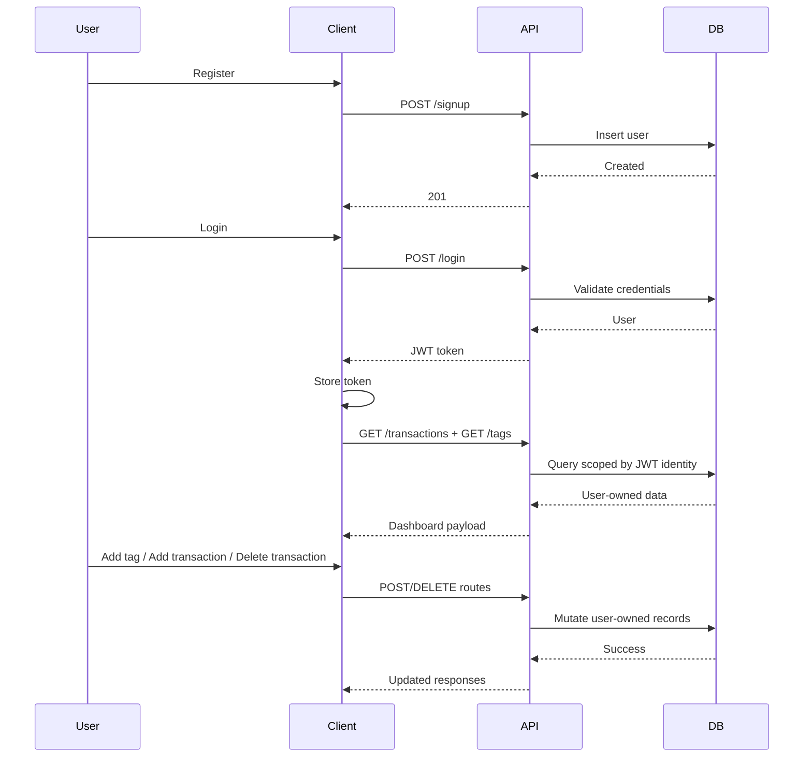
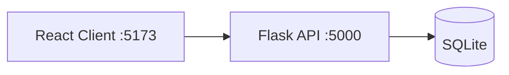
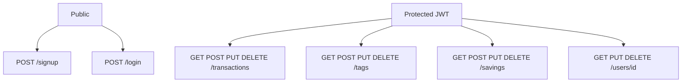
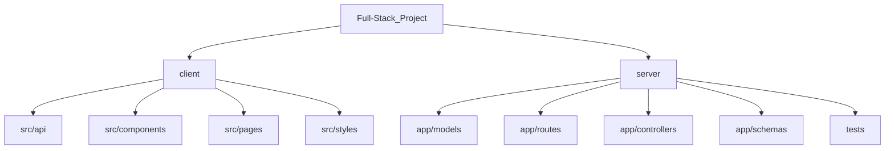

# Executive Finance Platform

## Functionality

- Account registration via public signup endpoint
- Secure login with JWT
- Protected dashboard access
- Transaction CRUD
- Tag CRUD
- Savings CRUD
- Recent-month transaction charting
- Full transaction rows under chart
- Sidebar collapse to expand analysis area
- Theme toggle with icon states
- SweetAlert feedback for auth and CRUD actions

## How It Works



## Updated ERD

```mermaid
erDiagram
  USERS ||--o{ TRANSACTIONS : owns
  USERS ||--o{ SAVING_GOALS : owns
  TRANSACTIONS ||--o{ TRANSACTIONS_TAGS : maps
  TAGS ||--o{ TRANSACTIONS_TAGS : maps

  USERS {
    int id PK
    string name
    string email UNIQUE
    int age
    string password
    string role
  }

  TRANSACTIONS {
    int id PK
    string name
    int user_id FK
    float amount
    date date
  }

  TAGS {
    int id PK
    string name
  }

  SAVING_GOALS {
    int id PK
    string title
    int goal
    int amount
    date goal_date
    date start_date
    int user_id FK
  }

  TRANSACTIONS_TAGS {
    int transaction_id FK
    int tag_id FK
  }
```

## Runtime Topology



## API Surface



## Project Map



- [client/src/api](client/src/api)
- [client/src/components](client/src/components)
- [client/src/pages](client/src/pages)
- [client/src/styles](client/src/styles)
- [server/app/models](server/app/models)
- [server/app/routes](server/app/routes)
- [server/app/controllers](server/app/controllers)
- [server/app/schemas](server/app/schemas)
- [server/tests](server/tests)

## Run

1. Backend

```bash
cd server
python3 -m venv .venv
source .venv/bin/activate
pip install -r requirements.txt
cp .env.example .env
.venv/bin/flask --app app run
```

2. Frontend

```bash
cd client
npm install
npm run dev
```
