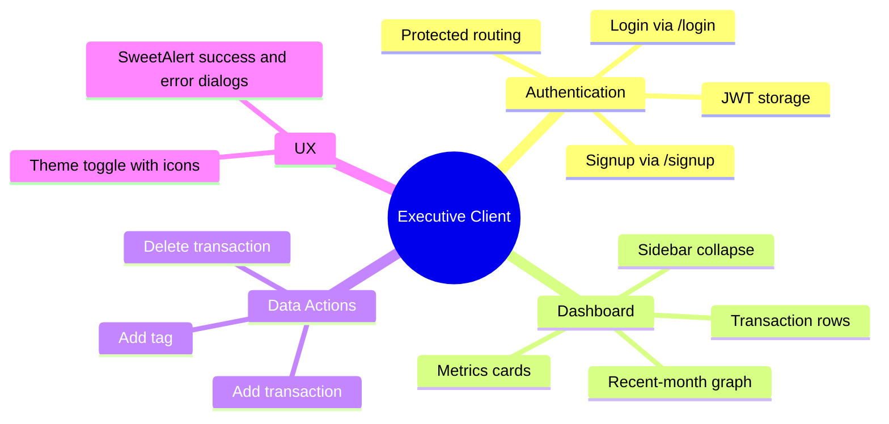
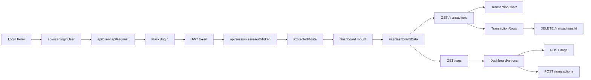
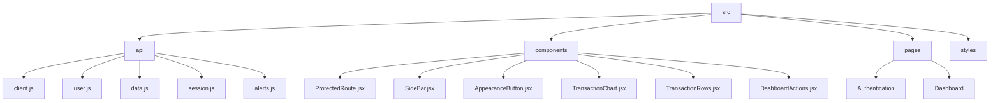
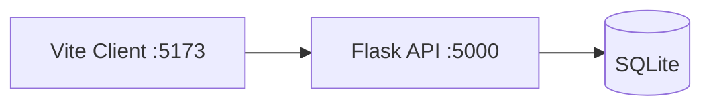

# Client Application Guide

## Capability Map



## Data Flow



## Component Structure



- [src/api](src/api)
- [src/components](src/components)
- [src/pages](src/pages)
- [src/styles](src/styles)

## Route Graph

```mermaid
flowchart TD
  A[/] --> B{token exists}
  B -- yes --> C[/dashboard]
  B -- no --> D[/authentication/login]
  D --> E[/authentication/signup]
  C --> C1[/dashboard/expenses]
  C --> C2[/dashboard/savings]
  C --> C3[/dashboard/settings]
```

## Runtime Contract



Env used by client:
- `VITE_API_URL` (default fallback: `http://127.0.0.1:5000`)

## Start

```bash
cd client
npm install
npm run dev
```
