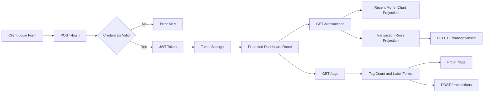
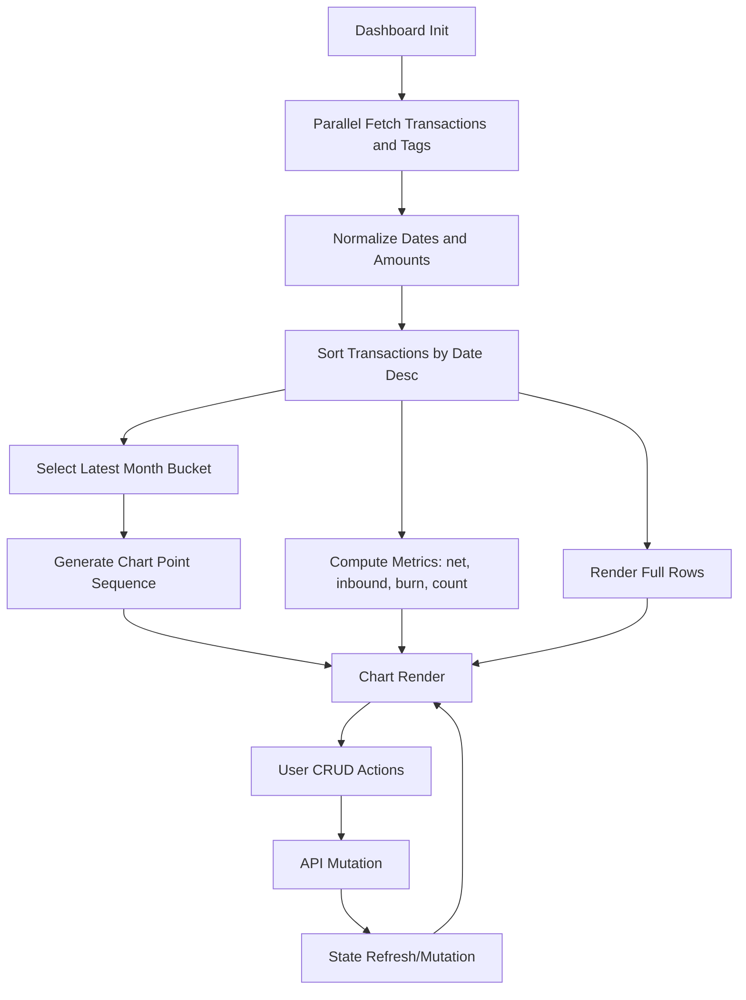
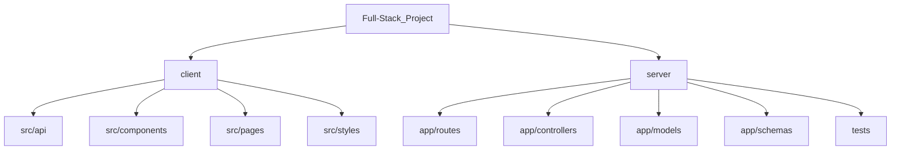

# Change Ledger

## Detailed Change Log

### Backend: Auth, Access Scope, Validation, API Contracts

1. Added strict user email validation at model level
- File: server/app/models/users.py
- Added SQLAlchemy validates hook for email normalization and format enforcement.
- Email is trimmed, lowercased, and regex-validated before persistence.
- Invalid format now fails early during model assignment, preventing silent bad records.

2. Added default role value for users
- File: server/app/models/users.py
- Added model default for role to reduce creation-time failures when role is omitted.
- Seed compatibility preserved for explicit role values.

3. Enforced per-user data filtering for protected resources
- Files:
  - server/app/routes/users.py
  - server/app/routes/transactions.py
  - server/app/routes/savings.py
  - server/app/controllers/users_controller.py
  - server/app/controllers/transactions_controller.py
  - server/app/controllers/savings_controller.py
- All list/read/update/delete operations now use JWT identity as scope boundary.
- User, savings, and transactions are retrieved only when ownership matches authenticated identity.
- Write operations no longer trust inbound user_id for ownership-sensitive records.

4. Normalized create/update ownership behavior
- Files:
  - server/app/controllers/transactions_controller.py
  - server/app/controllers/savings_controller.py
- user_id is now sourced from authenticated identity for create/update operations.
- Prevents client-side ownership spoofing in request payloads.

5. Expanded route-level validation and error handling
- Files:
  - server/app/routes/users.py
  - server/app/routes/login.py
  - server/app/routes/transactions.py
  - server/app/routes/savings.py
  - server/app/routes/tags.py
- Invalid body types (non-object JSON) return clear 400 responses.
- User create/update routes now catch both schema validation and model validation errors.

6. Added dedicated public signup endpoint
- File: server/app/routes/signup.py
- New POST /signup route supports registration without token.
- users POST remains protected by jwt_required.
- Handles validation errors and duplicate-email integrity conflicts.

7. Registered signup route in app factory
- File: server/app/__init__.py
- Added signup blueprint import and registration.
- Preserved existing route prefixes and existing protected routes.

8. Improved pagination helper flexibility
- File: server/app/services/paginate.py
- paginate now accepts either model classes or already-filtered query objects.
- Enabled clean integration with identity-filtered query pipelines.

9. Stabilized Flask route loading after syntax correction
- File: server/app/routes/users.py
- Fixed malformed try/except indentation that caused SyntaxError during flask CLI app import.

### Frontend: API Integration, Routing, Dashboard, UX, Alerts

10. Added modular API client
- File: client/src/api/client.js
- Centralized base URL resolution and HTTP request behavior.
- Added URL query assembly support.
- Added robust network-failure messaging with actionable diagnostics.

11. Added auth token session module
- File: client/src/api/session.js
- Added token save/read/clear helpers.
- Supports remember-me split between localStorage and sessionStorage.

12. Added auth API wrappers
- File: client/src/api/user.js
- Added loginUser and createUser request helpers.
- createUser migrated from protected users route to public signup route.

13. Added data API wrappers for CRUD
- File: client/src/api/data.js
- Added transaction and tag get/create/update/delete helpers.
- Standardized client-side API call signatures.

14. Enabled protected dashboard routing
- Files:
  - client/src/App.jsx
  - client/src/components/ProtectedRoute.jsx
- Added token-gated route guard around dashboard tree.
- Root and wildcard redirects now branch by auth state.

15. Implemented login API flow
- File: client/src/pages/Authentication/LogInPage.jsx
- Bound form fields to state.
- Added submit loading state and remember-me behavior.
- Added token persistence and redirect to dashboard on success.

16. Implemented signup API flow
- File: client/src/pages/Authentication/SignUpPage.jsx
- Bound registration form to state.
- Added submit loading state.
- Added redirect to login after successful registration.

17. Added SweetAlert2 for user feedback
- Files:
  - client/src/api/alerts.js
  - client/src/pages/Authentication/LogInPage.jsx
  - client/src/pages/Authentication/SignUpPage.jsx
  - client/src/components/DashboardActions.jsx
  - client/src/pages/Dashboard/OverviewPage.jsx
- Added success alerts for login, signup, add-tag, add-transaction, delete-transaction.
- Added error alerts for auth failures, CRUD failures, and delete failures.
- Added delete confirmation modal for transaction removal.

18. Added dashboard data orchestration hook
- File: client/src/pages/Dashboard/useDashboardData.js
- Centralized fetch, transform, aggregate, and mutate logic.
- Added recent-month extraction for chart data.
- Added derived summary metrics and local optimistic refresh behavior.

19. Added modular chart component
- File: client/src/components/TransactionChart.jsx
- Renders trend line from most recent month transaction amounts.
- Includes axis labels and dynamic range markers.

20. Added modular transaction rows component
- File: client/src/components/TransactionRows.jsx
- Renders complete transaction list below chart.
- Includes tags, amounts, and delete action control.

21. Added modular dashboard actions component
- File: client/src/components/DashboardActions.jsx
- Added Add Label Tag form mapped to tags POST.
- Added Add Transaction form mapped to transactions POST.

22. Implemented sidebar collapse/expand behavior
- Files:
  - client/src/components/SideBar.jsx
  - client/src/pages/Dashboard/Dashboard.jsx
  - client/src/styles/Dashboard.css
- Added collapse toggle control.
- Added collapsed-state layout behavior to enlarge content area.
- Added logout action control.

23. Added icon-enhanced appearance button
- Files:
  - client/src/components/AppearanceButton.jsx
  - client/src/styles/AppearanceButton.css
- Added sun/moon mode iconography and aligned button layout.

24. Expanded and modularized styling
- Files:
  - client/src/styles/Dashboard.css
  - client/src/styles/LogInPage.css
  - client/src/styles/AppearanceButton.css
  - client/src/styles/TransactionChart.css
  - client/src/styles/TransactionRows.css
  - client/src/styles/DashboardActions.css
- Added responsive layout rules.
- Added smooth scroll behavior for dashboard content.
- Added visual states for alerts, buttons, placeholders, and CRUD table actions.

### Config and Environment

25. Added runtime env usage in backend config path
- File: server/app/__init__.py
- Uses DATABASE_URL and JWT_SECRET_KEY with defaults.

26. Added env template baseline
- File: server/.env.example
- Captures required and optional local runtime settings.

## Data Flow Diagram

## Algorithm Diagram

## Project Structure Link Diagram

- [client/src/api](../client/src/api)
- [client/src/components](../client/src/components)
- [client/src/pages](../client/src/pages)
- [client/src/styles](../client/src/styles)
- [server/app/routes](app/routes)
- [server/app/controllers](app/controllers)
- [server/app/models](app/models)
- [server/app/schemas](app/schemas)
- [server/tests](tests)
